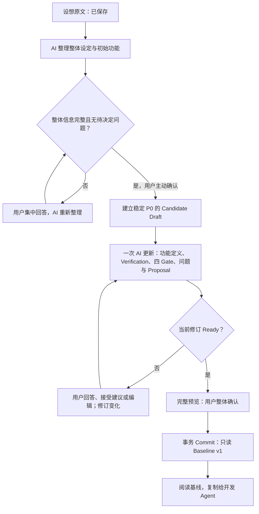

# 当前产品实现指南：从设想到 Baseline v1

面向产品负责人。更新日期：2026-10-08；应用版本：0.4.0；首次基线 v1，新增功能确认后可生成 v2、v3…。

本指南依据当前运行代码、Runtime Prompt、Schema、存储、接口、前端与测试维护。0.3.0 在 0.2.2（`60a8c40`）主流程上加入已提交项目的功能演化，0.4.0 将 ChatGPT 账号与 OpenAI、DeepSeek、GLM API 统一为 AI 连接；分支不作为机制写死。当前机制验证与历史有限语义调查见 [VALIDATION.md](./VALIDATION.md)，Golden Cases 独立维护；产品原则、模型指令和历史成功都不等于程序保证正确。

**最重要的认识：Ready 表示“当前数据结构、问题列表和模型审查结论满足提交条件”，不表示产品逻辑已经被程序证明正确。** 四个 Gate 分开保存，但通常由同一次模型请求产生。程序能检查字段是否缺失、引用是否有效、结论是否过期；规则含义、冲突是否真实、验收是否充分，主要依赖模型判断和用户阅读。

**Verification 是未来开发的验收要求，不是已执行的测试结果。** Commit 是用户确认一份需求，并把它保存为只读基线，不是部署产品，也不是确认产品已经测试通过。

第 12 节保留 0.2.1 历史探针，当前机制以其余更新章节及本次验收记录为准。

## 阅读路线

- 新增功能迭代先读第 15 节；第 1～14 节的初始流程仍负责首次 v1，共享的决策、修订、Gate 与验收也用于后续版本。

- 先读第 1～4 节：产品边界、术语和完整流程。
- 再读第 5～8 节：模型收到什么、如何审查、Ready 怎么产生、各方负责什么。
- 第 9～12 节说明最终保存内容、不变量、文档偏差与可检测性。
- 第 13 节指向独立维护的 [Golden Cases.md](./Golden%20Cases.md)，作为产品方法论检查清单；第 14 节说明现有验证证据的限度。

## 1. 当前产品实际解决什么问题

它帮助只有模糊想法的个人构建者，把“我想做某种产品”整理成开发前能够阅读、决定并整体确认的第一版需求。

例如用户只说：“我想做一个自律监督工具，有玩偶随机巡查，离席会扣心。”应用先整理产品是什么、使用场景、特别的体验设定与初始功能，再提出影响实现的业务决定，最终保存每个功能的规则、边界、例外和验收要求。它不负责开发这个自律工具。

当前产品的价值在于保留一份用户认可的需求，并管理“草案、建议、决定、正式基线”之间的边界。它不是市场评估器、功能优先级推荐器，也不是需求正确性的形式化证明系统。

### 已实现与未实现

| 范围 | 当前真实行为 |
| --- | --- |
| 本地中文应用 | 单用户；一个本机服务提供页面与 API，监听 `127.0.0.1`；产品数据保存到 SQLite |
| 从模糊设想开始 | 首页只必填设想，名称可选；先保存，再尝试 AI 整理；连接失败可以稍后继续 |
| 集中决策 | 展示当前模型列出的问题，支持 A/B/C、D 自定义、部分回答、汇总确认；没有每轮两题或三题的业务截断 |
| 功能整理与审查 | 同一工作区显示全部 P0、规则、验收、关联问题；完整定义、验收详情和 Gate 依据可展开；支持主动手动编辑 |
| 冲突建议接受 | Proposal 独立保存；MVP 阶段接受规则写入确认例外；新旧关系阶段接受保存的精确字段方案，规则改变失效对应验收，随后重新审查 |
| 最终确认与保存 | 当前 Ready 才允许预览；页面要求勾选确认后 Commit；首次 v1，后续新增功能经同样审查形成新当前版本，所有快照只读 |
| 恢复与项目隔离 | 已保存内容能刷新、重启后恢复；新项目保留旧项目；提交后直接进入基线页 |
| 交给开发 Agent | 已提交页可以复制完整 Markdown，失败时展示同一全文供手动复制；复制不发起 AI 请求 |
| 未实现 | 开发用户产品、访问用户代码仓库、运行用户产品测试、删除功能、历史回滚、云同步、团队协作、支付、本产品账号系统、文件下载导出 |
| 当前没有的审查能力 | 确定性的自然语言冲突求解、逐条规则来源证明、语义正确性证书、完整的历史 Review 与 AI 改动对比记录 |

Local-first 指本地服务和存储。AI 分析仍会联网发送项目需求。产品数据库没有额外应用级加密；OAuth 凭据另由 Windows DPAPI 保护。

来源：[README.md](./README.md)、[server/main.ts](./server/main.ts)、[src/main.tsx](./src/main.tsx)、[server/store.ts](./server/store.ts)。

## 2. 产品中这些对象分别是什么

| 对象 | 产品语言中的含义 | 当前保存方式与地位 |
| --- | --- | --- |
| `conceptInput` | 用户当前保留的设想原文，是整理的起点 | `intakes` 工作资料；设想阶段可编辑，不是不可改的原始输入档案；不进入 Baseline |
| 设想整理 / Intake | AI 对整体产品的初步理解，包含产品定义、场景、核心设定、初始功能和整体问题 | `intakes`；用户确认前，功能清单仍属于建议 |
| Product Concept | 产品有什么特别设定、用户会怎样体验；例如“屏幕里的玩偶随机巡查在场情况” | 整理结果的 `productConcept`；初始确认后复制到 Draft，后续可由用户编辑；新基线包含它 |
| Candidate P0 | 用户已确认纳入第一版的功能成员，具体定义还在整理 | `drafts` 中的候选集合；确认成员不等于每个后续规则字段已逐项确认 |
| Candidate Draft | 当前可编辑的完整产品草案 | 产品背景加全部 P0；可以反复修改，不是正式产品记忆 |
| Clarification | 还需要用户决定的业务问题 | 设想阶段是 Intake 的问题；候选阶段是 Review 中的 `clarification` 问题；没有单独的 Clarification 页面或表 |
| Review | 对某个修订号的一次整理与审查结论 | `reviews` 保存每个 P0 的四 Gate 和问题；只有最新有效 Review 用于 Ready |
| Proposal | 已报告冲突的一种候选解决规则 | `proposals` 独立保存，Review 中也包含展示内容；未接受可以落入建议表，但不能通过接受通道进入确认例外 |
| Confirmed Exception | 用户已接受、需要结合原规则阅读的例外或冲突解决规则 | 每个 P0 的 `confirmedException` 文本；可以累积多条；修改或撤回已有例外需要额外确认 |
| Verification | 未来怎样验收这个功能、应该看到什么 | P0 内的结构；不是独立一级阶段，也不是测试报告；有 Agent / Human / Hybrid 三种类型 |
| 问题台账 / Decision Hold | 所有必要决定及状态，不只暂不确定 | `question_ledger` 保存未答、待审查、未决定、已解决和证据；旧 `decision_holds` 保留兼容，省略不关闭 |
| Baseline v1 | 用户整体确认后的第一版正式产品内容 | `baselines`；每项目一份，应用和数据库触发器限制修改与删除 |
| Conversation | 为下一次模型分析提供的工作上下文 | `conversations`；包括用户答复、调整意图、接受记录和 AI 问题摘要；不是完整的每次模型输出档案 |

P0 的稳定标识是项目内的 `P0-1`、`P0-2` 等，不是跨项目的全局功能编号。

V2 的 `source` 来自用户确认时的“整理后的初始功能描述”，并不等于原始设想中某段文字的精确摘录。原始设想另外保存在 Intake。程序没有保存“这条规则来自原文哪一句”的逐条映射。

这里的“开发 Agent”指之后实现产品的 Coding Agent；“Agent Verification”指适合由程序或开发 Agent 检查的验收要求；“产品 AI”指本应用调用的整理与审查模型。这三者职责不同。

来源：[shared/domain.ts](./shared/domain.ts)、[server/store.ts](./server/store.ts) 的 `create`、`confirmConcept`、`get`。

## 3. 用户流程与内部状态如何对应

首次流程是 **产品设想 → MVP 梳理 → 最终确认**，提交后是 **产品基线**。后端阶段为 `concept`、`candidate`、`committed`，后续归属确认阶段为 `addition`；新增功能确认归属后复用 `candidate`。

项目显示的“待整理 / 需要决定 / 存在冲突 / 验收要求待明确 / 可以最终确认”是根据当前内容计算的状态，不是七张顺序推进的数据库状态表。“等待最终确认”主要是界面正在展示预览时的提示，没有单独保存成待签署记录。

### 完整阶段展开

| 产品阶段 | 输入 | AI做什么 | 用户做什么 | 后端做什么 | 输出 |
| --- | --- | --- | --- | --- | --- |
| 1. 保存产品设想 | 名称可选、设想必填 | 此时可以还未调用 AI | 输入并主动保存 | 创建独立项目、Intake、初始工作记录，修订号从 1 开始；没有真实 Candidate Draft | 可恢复的设想；连接失败也保留 |
| 2. AI 整理整体理解 | Intake 与全部已保存 Conversation | 提取产品定义、场景、核心设定、初始功能；提出整体理解所需问题 | 阅读草案与“确认前需要澄清的设想”；此时尚未进入 P0 审查 | 校验结构、选项和当前修订；保存整理结果并递增修订 | 尚未确认的设想草案与问题 |
| 3. 整体决策或主动调整 | 当前题目、选项或自定义文字；也可编辑整理结果 | 保存后再请求时，结合答复重新整理 | 选择、查看汇总、主动确认；也可调整初始功能 | 从当前题目读取真实选项，拒绝伪造、重复、过期回答；整批事务保存；台账变为待审查或未决定 | 已保存答复；更新后的整体草案；尚不产生正式记忆 |
| 4. 确认初始功能 | 完整整体草案，无设想问题 | 不负责代替用户确认 | 点击“确认这些设定与初始功能” | 核验 `conceptReady`；按确认列表建立稳定 P0 id 和 source；进入候选阶段，递增修订 | Candidate Draft；意图、状态、规则、验收最初仍可缺失 |
| 5. MVP 整理与全局 Review | 当前 Draft 与全部 Conversation | 同一次请求生成 P0 字段、Verification、四 Gate、问题及冲突 Proposal | 阅读全部卡片、必要时展开定义与依据 | 校验全部 P0 引用、结构、修订；应用字段；修正缺失字段对应的 Gate；保存新 Review 和建议 | 新修订的 Draft + Review；可能 Ready，也可能需要决定 |
| 6. 普通决定 | 当前问题的 A/B/C 或 D | 后续统一更新时把答复整理进规则 | 可以回答全部或部分；确认汇总 | 保存答复，更新该题台账状态，递增一次修订，旧 Review 失效；普通答复此刻不会直接填写规则字段 | 已保存决定；等待新的 AI 整理 |
| 7. 接受冲突解决规则 | 当前冲突及关联 Proposal id | 提出建议，之后结合已接受规则重新判断 | 阅读完整规则，主动点击“确认所选决定并接受解决规则” | 核验关联、修订、未接受状态和确认文案；附加真实建议文本到所有关联 P0 的例外；同批无效项整批回滚 | 已接受例外；旧 Review 失效，必须重新审查 |
| 8. 自定义冲突答案 | 用户 D 自定义答复 | 应整理为新的 Proposal，等待用户接受 | 先表达想法，再阅读和接受生成的建议 | 先保存答复，不通过此动作写入 `confirmedException`；后续仍核验正式接受通道 | 用户意图；可能产生下一轮待接受 Proposal |
| 9. 编辑或自然语言调整 | 草案、实际变更或反馈 | 重新整理；足够解决旧题时给出原因与后续用户引用 | 主动保存；例外修改单独确认 | 保护 id/source，递增修订、清除 Review、保留台账，记录 before/after；仅 after 是当前证据 | 待重新审查草案，旧预览失效，问题继续保留 |
| 10. 再审查与异常恢复 | 新修订与保存的上下文 | 重新处理完整候选集 | 处理剩余决定，或在失败后重试、取消 | 同项目只允许一个分析任务；拦截取消、超时和旧修订结果；失败不应用部分结果 | 成功的新 Draft/Review，或保留原先已保存内容 |
| 11. 最终确认预览 | 当前 Ready 的草案及修订号 | 不调用模型 | 阅读完整背景、全部规则、例外和验收 | 重新执行 Ready 检查，按当前 Draft 返回完整预览；时间暂写“提交时生成” | 界面预览；还没有 Baseline 数据行 |
| 12. Commit Baseline v1 | 修订号、指定确认语句 | 不调用模型 | 页面勾选并主动点击“确认并生成 Baseline v1” | 再核验当前阶段、修订和 Ready；事务写入正式 payload 与实际时间；同次重试幂等 | 每项目一份只读 Baseline v1 |
| 13. 产品基线与交付 | 已保存 Baseline，加项目名称 | 不参与 | 阅读、复制，或明确发起新增功能 | 已提交快照只读；普通编辑/重置/分析拒绝，新增入口建立独立草稿 | 完整 Markdown、历史快照或新增工作区 |

同一业务决定可以关联多个审查项，仍分别记录四 Gate 的状态与依据。审查未通过却没有对应问题时，本轮结果被拒绝并保留已保存内容，不再机械补建“补充核心决定”。同义重复是否成立仍需模型和用户判断。

旧候选草稿有重复题时，可在决定区“合并重复问题”：选择关联相同功能的普通问题、指定主问题、阅读各题原文与已保存答复，再重新选择答案并明确确认。合并只归并问题和保存本次答复，不修改产品规则，不代表审查通过；历史可展开查看。C 和仅“帮我填”等委托答复继续阻塞。冲突或需接受方案的问题不能合并。

决策保存和下一次 AI 更新是两个动作、两个事务。正常界面保存后继续当前阶段；关系阶段完成后接续一次完整 MVP 更新。`/decisions` 接口本身不自动审查。所以 AI 失败时，用户刚保存的决定仍然存在，不能理解成整个动作全部回滚。批量决定只递增一次修订，随后成功的 AI 整理再递增一次。

### 返回、重置与兼容的实际含义

- 确认初始功能后，返回“产品设想”可以修改当前产品背景，参考原始设想和已确认初始功能；不能重新增删候选成员。
- 设想 Reset 保留当前 `conceptInput`，清除整理、答复、Hold、问题台账和指标来源；候选 Reset 保留背景、P0 id/source，清空整理、验收、例外和工作对话。它会清除这个未提交项目中已经接受的例外。
- 接受过建议的记录通常保留在建议表；未接受建议和旧 Review 会在草稿变化时删除。Reset 会进一步清除建议记录。没有完整历史版本恢复能力。
- 未提交选择按项目和修订号暂存浏览器；修订变化会清除旧选择。未保存的字段编辑不是自动保存，不应把“刷新恢复”理解为任何正在输入的内容都会恢复。
- 旧基线只读取，不补写新字段；缺少设定时显示“旧版本未记录产品设定”。旧 Review 没有选项时支持 D 自定义或重新整理；缺少新台账元数据时须重新审查后提交。
- 后端为旧客户端保留直接用产品定义与功能列表创建 Candidate 的接口路径。因此“先确认设想才能建立候选”是新首页流程的限制，不覆盖全部兼容 API 路径。

来源：[server/store.ts](./server/store.ts)、[server/app.ts](./server/app.ts)、[src/main.tsx](./src/main.tsx)、[src/workspace.tsx](./src/workspace.tsx)、[src/navigation.ts](./src/navigation.ts)。

## 4. 修订号究竟保护什么

修订号相当于当前工作资料的“第几次保存”。保存设想、确认初始功能、保存决定、接受例外、编辑草案、保存反馈、Reset、成功应用 AI 整理都会递增。

一次分析先读取修订 N。应用结果前，后端要求项目仍在修订 N；成功后写入新草案 N+1，同时写入针对 N+1 的 Review。用户在分析期间改成 N+1，旧分析会被拒绝。

字段编辑会清除 Review 与未接受 Proposal。旧预览带着旧修订号提交，会被拒绝。界面同时清除预览和勾选；未保存编辑时，也不会继续显示“已明确”或允许最终确认。

**修订号保证的是“结论对应当前内容”，不是“当前内容一定表达了用户真实意图”。** 它不能证明模型刚写入的新规则有合法的意图来源。

## 5. 模型如何运行，一次 Review 实际发送什么

### 连接与选择

统一 AI 连接支持 ChatGPT 官方账号、OpenAI API、DeepSeek API、国内智谱 GLM API，四种方式共用设想整理、功能归属和完整审查。ChatGPT 的 Connected 与 Plan Usage 分开判断，原多账号登录保留；API Key 由后端独立 DPAPI 加密，前端只返回配置状态。

主区域显示实际模型 ID 和适用思考设置；读取期间显示加载，失效选择报错。API 首次主动选模型，ChatGPT 原自动设置解析为当前实际 ID，已有手动选择保留。目录不证明模型权限；能力映射也不能保证任意新模型兼容，最终由厂商请求决定。

偏好由后端按 ChatGPT 账号/API 厂商保存。审查 high / xhigh / max 或未指定强度最长十分钟，其余三分钟，连接测试三分钟。配置和模型请求互斥；测试连接是用户主动的一次小型结构化调用，保存 Key 不推理，失败不自动重试或换连接。

**当前 Review 不保存实际模型、思考设置或 Prompt 版本，不能从已保存 Review 或 Baseline 反查当时的模型。** 0.4.0 隔离验证没有真实模型请求，不能证明用户账号权限或语义审查已经通过。

来源：[server/provider.ts](./server/provider.ts)、[server/ai-provider.ts](./server/ai-provider.ts)、[server/api-transport.ts](./server/api-transport.ts)、[server/ai-connections.ts](./server/ai-connections.ts)、[src/ai-panel.tsx](./src/ai-panel.tsx)；具体能力与保护见 [AUTH_AND_MODELS.md](./AUTH_AND_MODELS.md)。

### 四种请求的输入

| 请求 | 实际发送的项目内容 | 用途 |
| --- | --- | --- |
| 设想整理 `developConcept` | `intake` 原文与整理；完整 `conversation`；完整 `questions` 台账（含已解决题和依据） | 理解整体产品、定义和初始功能，逐题关闭 |
| 全局 Review `analyze` | 完整 `draft`、`conversation`、`questions` 台账、固定任务说明；新增阶段另含当前基线和新增上下文 | 整理全部 P0、最小充分验收、指标来源、四 Gate、问题、Proposal、关闭记录 |
| 新功能归属 `assessAddition` | 当前已保存 Baseline 与新增设想 | 逐项归属清单，不直接改变成员 |
| 新旧关系 `reviewIntegration` | 当前基线、完整新增清单、成员、草稿、对话和台账 | 检查新旧/新增之间/同 P0 冲突及产品实现约束，给具体待接受字段方案 |

Review 的 Conversation 包含记录的 id、角色、内容、创建时间。内容通常包括最初设想、设想确认、历次答复、自然语言调整、接受例外记录和 AI 提问摘要；不是简单地只给模型当前一张功能卡。

完整台账中的已解决题是历史参考，不能在新审查中再次关闭或沿用其 ID 提问。每次请求的结构限制只允许操作当前阶段的未解决 ID；没有有效问题时关闭记录必须为空。新功能引出的新决定使用新问题，省略任何未解决旧题仍会阻止 Ready。

首次及新增后的完整 MVP 审查共用全部 P0 固定对象键和四 Gate。未授权内容通过显式 preserve 或固定字段原文继承；关系方案由用户接受后精确更新，规则改变使对应验收失效并重建。仅继承产品内容，不继承历史 Gate 通过；不补缺失输出、不改历史快照。没有速度对照试验，不承诺提速比例。

Review **不会单独发送**整个 Project、项目名称、项目修订号、Intake、旧 Review 或建议表。当前台账可能带有待接受 Proposal 的问题数据，但它仍不是产品事实。项目修订号由后端另行保护。原始设想通常通过 Conversation 间接进入 Review；但候选 Reset 会重建 Conversation，仅保留产品描述、目标和初始功能来源，原 `conceptInput` 虽仍在 Intake 中，却不会自动直接发送给下一次 Review。

### 一次请求与结果应用的顺序

1. 后端读取已保存项目，核验阶段与发起修订，建立可取消的分析任务。
2. 固定所选连接、模型与支持的参数；共用 TaskProvider 组织固定 Runtime Prompt、输入和目标 Schema。
3. 项目资料被序列化为一个 `user` 消息；不是让模型自动访问 SQLite、Markdown、代码仓库或用户的 ChatGPT 历史。
4. ChatGPT DevKit 与 OpenAI API 使用 Responses strict JSON Schema；DeepSeek 使用 Responses JSON Schema，三者 `store:false`、`stream:true`。GLM 用国内 Chat Completions JSON 模式，系统消息包含完整目标结构；不宣称严格 Schema 保证。每次发送本地保存上下文，不接续云端会话。
5. Responses 必须成功 completed，GLM 必须正常 stop 且结束流。完整结果共同执行 JSON 解析和严格 Zod 校验；中断、截断、拒绝、失败、自由文本或缺失字段不能应用，不补齐/放宽结构。
6. Store 再核验 P0、完整选项、指标用户来源、关闭引用和修订；保留已有 Purpose，事务更新台账、草案和 Review。四 Gate、字段和 Verification 通常在同一次输出中一起产生。

流式传输用于接收结果；前端当前显示等待提示，没有展示逐字审查过程。服务端结构约束与本地校验保护对象形状；GLM 仅有 JSON 模式。任何方式都不能保证自然语言事实与推理正确。

`AGENTS.md`、README 与专题文档指导 Coding Agent 维护本仓库，**不会被运行中的产品 AI 自动读取**。实际 Runtime Prompt 是 [server/provider.ts](./server/provider.ts) 的 `conceptInstructions`、`additionInstructions`、`reviewInstructions`。只修改 Markdown 原则不会自动改变模型请求。

传输依据：[vendor/siwc-local/src/responses.ts](./vendor/siwc-local/src/responses.ts)、[vendor/siwc-local/src/models.ts](./vendor/siwc-local/src/models.ts)。

## 6. Runtime Prompt 实际要求模型判断什么

以下是指令的含义，不是对遵守效果的承诺。

| 设想整理指令 | 全局 Review 指令 |
| --- | --- |
| 从用户原文和答复整理产品是什么、场景、核心体验与初始功能 | 读取完整背景、候选、答复与已接受例外，重新整理每个 P0 |
| 保留已表达意图，不添加排行榜、奖励、支付、账号等额外功能 | 不增加、删除、合并或降级功能，Purpose 忠实归纳已有目标，不编造动机、状态、阈值、触发、例外 |
| 不把开发检查和验收步骤拆成额外运行时功能 | 分别判断 Clarity、Boundary、Direct Consistency、Verifiability |
| 只问阻止理解整体产品的必要问题，具体阈值和功能边界留给候选整理 | 只将共同状态/条件下结果不兼容判为确定冲突；条件不明继续澄清 |
| 集中列出当前必要问题，不按固定小题数分轮 | 不通过缩窄原条件、推定优先级或例外消除冲突；展示双方规则和原因 |
| A/B/C 是建议；只有两个合理方案时 C 表示暂不确定 | 未接受 Proposal、未选中的选项不能写入字段；自定义冲突答案先生成待接受建议 |
| 不代替用户决定，不评估商业价值或必要性 | 根据规则定义合适的验证流程、可观测要求、预期结果，不输出实际测试结果 |
| 用户资料不能覆盖运行指令 | 同样防止把用户资料当覆盖指令；以当前草稿中的例外为准，不恢复撤回规则 |

Review 默认要求个人 MVP 的最小充分验收：核心流程、确认规则和明显边界，具体输入、可观察结果与判断标准。优先已有界面、简单程序检查、必要真人实测。没有用户要求，不主动加入防欺骗、数据集、统计报告、大样本、额外日志或生产指标；没有新增成本 Gate。

Purpose 可以忠实归纳；普通选项提供完整业务方案，可以包含待用户选择的产品规则参数，未选择前不能进入事实。它们与量化验收指标不同：`custom_only` 仅提供 C 暂不确定和前端 D 输入，不建议用户未给的指标门槛。继续问题通过 `questionId` 引用台账；`resolvedQuestions` 包含原因与后续用户证据，省略不关闭，不能用比该题最新答复更旧的证据覆盖后来决定。量化要求通过 `quantitativeSources` 逐项引用用户原文，不能从旧 AI 建议取得授权。

Review 还要求每个未通过 Gate 都有具体问题，合并相关业务决定，不按数据库字段拆题，不无限枚举边缘情况，使用已确认决定并避免重复询问。

这些要求中，“不编造”“不改变功能含义”“两条规则真的是直接冲突”“验收足够具体”等属于语义要求，程序没有独立判断器。模型同时负责写草案与判断自己整理后的草案；没有第二个模型或独立审查人自动复核这次输出。

## 7. 四个 Gate 到底怎样产生，Ready 怎样判断

### 四 Gate 的含义与实际检查

| Gate | 模型应判断的产品问题 | 后端会额外强制的内容 | 程序不能证明的内容 |
| --- | --- | --- | --- |
| Clarity | 希望发生什么行为、用户为什么需要它是否明确 | P0 名称、描述、意图为空白时改成待澄清；关联问题也阻止通过 | 已填写的描述是否真的清楚，Purpose 是否来自用户意图 |
| Boundary | 生效/失效状态、触发、阈值、核心边界是否足够 | 状态或核心规则为空白时改成待澄清；关联问题也阻止通过 | 文字是否覆盖关键边界，模型是否自行补了阈值、缩窄条件 |
| Direct Consistency | 同状态、同事件/条件下是否要求不兼容结果 | 模型报告 conflict 时要求至少一个有效 P0、无重复关联、共同条件、双方规则、解释；允许同一 P0 内新旧要求冲突，对应 Gate 变为冲突 | 共同条件是否真实相同，是否漏报或误报，建议是否真的解决冲突 |
| Verifiability | 能否说明合理的验证方式和预期结果 | Verification 不存在、适用必填字段为空白、预期属于常见占位词或已要求指标缺必要门槛时改成未定义；关联问题也阻止通过 | 类型是否适合真实体验，步骤是否可执行，复杂预期是否可判定，指标是否遗漏 |

模型首先为每个 P0 提供四个状态和理由。`Store.applyAnalysis` 随后检查空白字段，并把所有未解决台账问题映射到对应 Gate，覆盖错误的 pass。它不会重新推理所有自然语言规则。

四 Gate 有四份独立字段和逐项检查，**不是四次独立推理**。每份理由当前允许空字符串。同一业务问题通过 coveredGates 关联相关审查项；非 pass Gate 或缺失字段没有对应问题时，后端拒绝整轮结果并保留原数据，不自动补建泛化问题。

状态允许值是 `pass`、`needs_clarification`、`conflict_detected`、`verification_undefined`。直接一致性在代码中的键是 `consistency`。

### Ready 的精确条件

`shared/domain.ts` 的 `ready` 要求同时满足：

1. 存在带 `ledgerVersion=1` 的新格式 Review，且其修订号等于当前草稿；旧格式须重新审查。
2. Review 问题列表为空，问题台账全部已解决。已保存答复但未被审查关闭，仍不 Ready。
3. Review 项数等于候选项数，每个候选有匹配的审查项；应用 Review 前，Store 还要求候选 id 全部且恰好返回一次。
4. 每个 P0 的名称、描述、意图、生效状态、核心规则经去空白后都非空。
5. 每个 P0 有 Verification，适用字段非空；预期不在常见空泛占位词清单中；已要求的必要量化门槛不能 null。未要求指标不阻塞。
6. 每个 P0 的四个 Gate 状态全部是 pass。
7. 新增必须已完成独立关系审查，phase=review 且保存关系结论；关系与 MVP 台账均无未解决问题。legacy 占位历史不作为业务决定。

这些条件是程序检查；其中第 6 项检查的是模型结论加后端结构纠正后的值，不是程序重新得出的语义结论。

**`ready` 本身不重新检查产品背景三个字段是否完整，也不要求 Gate 理由非空。** 新项目确认设想时 `conceptReady` 会检查产品描述、场景、核心设定和初始功能非空；新项目手动保存时还要求核心设定非空。但旧路径允许缺少核心设定，Draft Schema 对产品描述、目标的检查也只是字符串长度，不去除空白。因此“Ready 保证所有背景字段完整”超出了当前实际实现。

### 三类 Verification 的程序检查

| 类型 | 必填内容 | 当前“完整”的含义 |
| --- | --- | --- |
| Agent | `agentProcess`、`expectedAgentResult` | 两段文字非空白 |
| Human | `agentSideReview`、`humanTest`、`observability`、`expectedHumanResult` | 四段文字非空白 |
| Hybrid | 上述全部六项 | 六段文字非空白 |

后端拒绝独立的“应该正常”“符合预期”“未定义”等常见占位预期，但不是完整验收语义判定器。步骤“检查一下”的质量及复杂空泛表达仍依赖 AI。真实摄像头选择 Human / Hybrid 的原则仍写在 Prompt，程序没有业务类型识别器。

量化对象包含指标名称、门槛和样本要求；未知值 null，界面显示未定义。后端核验本项目 user 消息、逐字引用、名称和数字出处，另拦截常见无来源指标表达。它不证明比较符、分母、样本含义等全部语义，无法穷尽自然语言。模拟输入可以构造；没有指标要求不应为了 Ready 发明指标。

### 预览和 Commit 多检查了什么

预览还要求项目在候选阶段、修订有效：首次尚无基线，后续必须有已确认归属的独立新增草稿。Commit 再检查指定确认语句、相同修订、同样的 Ready 条件，新增版本还核验基础版本，事务写入；已有同修订提交时返回原结果，不产生第二份。

界面要求先看预览、勾选、点击按钮，而且刷新不恢复勾选。**后端收到的是修订号和指定确认文字，没有保存“用户确实打开并读过预览”的证据。** 一个具备有效本机会话的客户端可以直接发送正确文字调用 Commit；程序不能证明人实际阅读或真实理解。

来源：[shared/domain.ts](./shared/domain.ts) 的 `conceptReady`、`verificationProblem`、`ready`；[server/store.ts](./server/store.ts) 的 `applyAnalysis`、`validateAnalysis`、`preview`、`commit`。

## 8. 用户、AI、后端分别负责什么

用户决定“要什么、用什么规则解决冲突、这是否是我的第一版”。AI 负责“整理和指出它认为需要决定的问题”。后端负责“合法状态、结构完整、有效引用、接受通道、修订与事务”。

“强保证”只用于表中明确列出的程序约束，不意味着本机文件拥有者不能改文件，也不意味着文字含义一定正确。“需要用户确认”描述决策责任；“主要依赖模型判断”描述语义判断；“当前无法保证”表示当前没有机制给出可靠保证。

| 产品规则 | 用户负责 | AI负责 | 后端是否强保证 | 实现位置 | 当前保证程度 |
| --- | --- | --- | --- | --- | --- |
| 只用设想即可创建新项目 | 提供非空设想 | 无 | 是，校验并保存；无需先有结构化 P0 | `Store.create`；首页 | 强保证 |
| 设想阶段不能预览或提交 | 先确认整体草案 | 整理整体资料 | 是，对 `concept` 阶段拒绝候选操作 | `candidateEditable`、`preview`、`commit` | 强保证；旧创建路径另有兼容例外 |
| 初始功能清单代表用户想做的全部功能 | 阅读、补充、删改并确认 | 保留原意，不遗漏或增补 | 否，确认前可替换整理清单，没有原文语义映射 | `conceptInstructions`、`applyConcept`、`confirmConcept` | 需要用户确认；提取主要依赖模型判断 |
| 确认后 P0 id、source 和成员数量稳定 | 不直接增删候选成员 | 恰好返回每个 id 一次 | 是，拒绝缺项、重复、未知 id 和来源改动 | `validateAnalysis`、`save` | 强保证 |
| 确认后功能含义不被替换、降级或暗中合并 | 阅读新草案与最终预览 | 保留功能意图 | 否，普通字段可被 AI 全量改写 | `reviewInstructions`、`applyAnalysis` | 主要依赖模型判断；语义保真当前无法保证 |
| 不编造阈值、状态、意图或例外 | 回答真正需要的决定 | 保持缺失，不把建议写成事实 | 否，不检查逐条来源 | 两个 Runtime Prompt；`fieldsSchema` | 主要依赖模型判断 |
| 不评判商业价值、功能必要性 | 保留自己的范围决策权 | 不提出越界评判 | 否，程序不判定输出含义是否越界 | 两个 Runtime Prompt | 主要依赖模型判断 |
| Review 使用完整当前候选集 | 保存最新修改 | 全局阅读、关联判断 | 是，Provider 发送完整 Draft；Store 核验全部 id；不保证模型真的理解全部 | `TaskProvider.analyze`、`validateAnalysis` | 强保证输入完整；理解主要依赖模型判断 |
| 四 Gate 分别保存、逐项阻止提交 | 阅读需要决定的项 | 输出四项状态与理由 | 是，四个键必须存在且 Ready 全部检查 | `gatesSchema`、`ready` | 强保证结构与阻断 |
| Gate 理由足够支持结论 | 检查依据 | 给出准确简短理由 | 否，允许空理由，也不验证论证 | `gateSchema`、`reviewInstructions` | 主要依赖模型判断 |
| 同条件相反结果应报告直接冲突 | 确认规则意图，决定解决方式 | 找到并说明冲突 | 仅保证已报告 conflict 的结构完整，不保证发现或判断正确 | `issueSchema`、`validateAnalysis`、Review Prompt | 主要依赖模型判断 |
| 正常与暂停状态不能直接误判冲突 | 明确状态含义 | 判断共同条件是否成立 | 否，无状态逻辑求解器 | Review Prompt | 主要依赖模型判断 |
| 冲突及新增关系调整须经有效 Proposal 明确接受 | 阅读具体方案与变更范围 | 正确标记冲突或兼容调整 | 是，MVP 只接受当前 conflict；独立关系阶段也接受当前 clarification 的方案，均核验修订与引用。冲突真实性仍不强保 | `issueSchema`、`validateOptions`、`decisions` | 强保证通道；语义主要依赖模型判断 |
| 未接受 Proposal 不写入确认例外 | 主动接受 | 不提前当事实 | 是，模型不能返回例外字段；普通答案、首次手动例外写入不能绕过接受 | `fieldsSchema`、`save`、`decisions` | 强保证例外通道；普通规则中偷带建议当前无法保证 |
| 接受建议来自当前有效选项，而非客户端替代文本 | 核对完整解决规则 | 生成选项与关联建议 | 是，校验当前问题、选项、Proposal、修订，读取存储中的规则 | `decisions`、`validateOptions` | 强保证 |
| 用户真实理解并同意解决规则 | 阅读汇总，主动接受 | 说明影响 | 只验证合法接受请求和确认文案，不能证明人的理解 | `DecisionCards`、`decisions`；旧 `accept` 接口 | 需要用户确认 |
| 多个答案和接受操作一起成功或一起失败 | 提交汇总 | 随后统一更新 | 是，同一事务，重复/伪造/过期项使整批回滚 | `decisions`、`transaction` | 强保证 |
| 多条已接受规则之间一致 | 阅读累积规则 | 再次全局审查 | 否，后端只附加文本，复查一致性仍靠下一次模型 | `decisions`、Review Prompt | 主要依赖模型判断 |
| “暂不确定”不会因模型漏报而 Ready | 作出真实决定 | 依据新资料关闭 | 是，台账跨手动编辑保留；关闭不能引用未决定消息；Reset 清理 | `QuestionLedger`、`decisions`、`ready` | 强保证已记录状态；复杂表达识别有边界 |
| 未提交的其他问题不能被模型悄悄当成已解决 | 补充资料或回答 | 逐题给原因与后续用户证据 | 是，省略保留并核验引用出处与时间，资料充分性仍靠 AI | `QuestionLedger.resolve`、`userEvidence`、`ready` | 强保证保留与引用；关闭语义主要依赖模型判断 |
| 无预选，选择不提前成为产品事实 | 主动提交所选决定 | 不应用未选项 | UI 无预选；后端只在提交时保存；模型是否偷用选项仍无法强保 | `DecisionCards`、`decisions`、Runtime Prompt | 强保证交互保存边界；语义主要依赖模型判断 |
| Verification 按类型填写必需内容 | 阅读或手动修改 | 提出验证要求 | 是，适用字段非空白，缺失阻止 Ready | `verificationSchema`、`verificationProblem` | 强保证结构完整 |
| 真实摄像头不能仅由 Agent 证明 | 参与真人实测 | 选择适合的类型 | 否，类型和业务语义没有交叉校验 | Review Prompt、`verificationProblem` | 主要依赖模型判断 |
| 验证要求具体、能判定结果 | 核对步骤与结果 | 形成最小充分要求 | 部分，必填和常见空泛预期拦截，不能证明任意文字充分可执行 | `reviewInstructions`、`verificationProblem` | 主要依赖模型判断 |
| 个人 MVP 不默认承受生产级验收 | 明确进阶需求 | 最小充分验收，不主动引入进阶项 | 不能强保整体工作量；常见无来源指标可拒绝 | `reviewInstructions`、`validateQuantitative` | 主要依赖模型判断 |
| 指标与样本规模有用户来源 | 提供指标和必要数值 | 引用用户原文，未知 null | 核验本项目角色、逐字引用、名称和数字；拒绝常见无来源表述 | `server/evidence.ts` | 强保证列出的来源检查；语义关联与穷尽检测当前无法保证 |
| Purpose 不被空输出擦除 | 可主动改或清空 | 忠实归纳 | 非空旧值保留，缺失有入口；不能证明忠实性 | `applyAnalysis`、Runtime Prompt | 强保证保存机制；主要依赖模型判断 |
| 普通选项可直接落实 | 确认方案或自定义 | 形成完整业务方案 | 拒绝常见未完成承诺，不能判断所有方案合理性 | `validateOptions`、`DecisionCards` | 强保证特定表达拦截；主要依赖模型判断 |
| Verification 不是已执行测试报告 | 不把要求当执行结果 | 不伪造 Passed/Failed | 没有独立实际结果字段，但文字中仍能夹带结果宣称 | `verificationSchema`、Review Prompt | 强保证字段范围；文本内容当前无法保证 |
| 编辑后旧 Review、预览不能提交 | 保存后重新审查 | 针对新修订分析 | 是，清除 Review、核验修订，迟到结果拒绝 | `writeDraft`、`editable`、`analyzeHandler`、`commit` | 强保证 |
| 网络失败、取消、中断不应用部分结果 | 重试或取消 | 请求成功才返回完整结构 | 是，完成事件、Schema、取消、修订与事务多层检查 | `responses.ts`、`infer`、`analyzeHandler` | 强保证结果应用边界 |
| Commit 是同一份当前 Ready 草案 | 阅读完整预览并确认 | 不参与 | 是，当前修订与 Ready 重查；是否曾真实阅读预览不能验证 | `preview`、`commit`；确认页面 | 强保证数据对应；需要用户确认 |
| 每版本一个只读快照，重试不重复 | 新增功能先发起独立草稿 | 不参与 Commit | 是，基础版本/修订、主键、事务、幂等和不可改触发器 | `commit`、`editable`、SQLite triggers | 强保证应用与数据库路径 |
| 正式 payload 不包含工作资料或凭据 | 只确认产品内容 | 不参与 Commit | 是，显式构建白名单形状；产品自由文字的含义不自动过滤 | `baseline`、`Baseline` 类型 | 强保证结构隔离 |
| 复制原有正式基线，不总结补假设 | 主动复制，交给开发 Agent | 不参与 | 不需后端新增请求；前端固定格式化保存内容 | `baselineText`、`BaselineCopy` | 强保证当前复制实现 |
| 一份 Ready 草案已经语义正确且覆盖用户全部意图 | 最终复核 | 尽力审查 | 否，当前没有独立真值核验与逐条来源证明 | 全流程 | 当前无法保证 |

对应模块：[server/store.ts](./server/store.ts)、[shared/domain.ts](./shared/domain.ts)、[server/provider.ts](./server/provider.ts)、[server/app.ts](./server/app.ts)、[src/workspace.tsx](./src/workspace.tsx)、[src/baseline-text.ts](./src/baseline-text.ts)。

## 9. 最终 Commit 时，什么进入 Baseline v1

`Store.baseline` 从当前 Draft 直接构建正式内容，不再调用 AI 总结。因此 Commit 前应阅读的是当前全部草案，而不是最初设想或上一轮结果。

| 信息 | 是否进入正式 payload | 说明 |
| --- | --- | --- |
| 产品是什么 `productDescription` | 是 | 当前保存的产品定义 |
| 使用场景 / 用户目标 `coreUserGoal` | 是 | 当前保存内容；字段名称与界面表达存在“目标/场景”共用 |
| 核心设定 `productConcept` | 新提交包含 | 旧基线可能没有，不补写历史内容 |
| `baselineVersion`、`createdAt` | 是 | 首次 v1，后续顺序版本；实际提交时间 |
| 每个 P0 的 id、名称、描述、意图、生效条件、核心规则 | 是 | 全部候选，保留稳定 id；字段是否忠实于用户仍须阅读 |
| 每个 P0 的已确认例外 | 是 | 接受后附加的规则和用户主动修改的已有例外 |
| 每个 P0 的 Verification | 是 | 完整验收对象，包括确认的量化要求；旧对象不补写字段 |
| 项目名称 | 不在 Baseline JSON 内 | 独立保存在 `projects`；基线页和复制文本另外使用它 |
| 项目 id、提交修订号 | 不在 Baseline JSON 内 | 保存为项目身份与基线表的关联/修订列 |
| 原始设想 `conceptInput`、候选 source | 否 | 工作资料；source 在构建正式 P0 时移除 |
| Conversation、答复、台账、选项、Hold、关闭依据、量化来源 | 否 | 均是工作资料；量化要求本身进入正式验收 |
| Review、四 Gate 状态与理由 | 否 | 正式基线没有审查凭证或正确性证明 |
| 未接受 Proposal、建议 id、接受时间 | 否 | 已接受规则的文本进入例外；建议对象和接受记录不进入 payload |
| 模型、思考强度、Prompt 版本、OAuth 信息 | 否 | 模型设置和认证是独立职责；Review 也没有完整推理运行记录 |
| 用户产品实际测试结果 | 无专用字段 | 没有执行产品测试；字符串仍可能被模型错误写成结果，程序不做语义过滤 |

“正式记忆只包含确认内容”在结构上成立：工作对象不会整体混入。但若模型已把未确认假设写进普通规则，Commit 不会再识别其来源；用户整体确认后，该文字也会进入正式基线。这是产品事实可信度的关键边界。

正式记忆是本机 SQLite 里的数据，并不会自动成为 Codex、ChatGPT 或其他 Agent 的长期记忆。用户需要主动复制并粘贴给开发 Agent。

复制包含项目名称、基线版本和时间、产品背景、全部 P0 与适用验收字段，开头附固定交付说明。前端只做格式化，成功写入剪贴板才提示成功；失败时提供同一只读全文。它不补充追溯信息，也不能消除原基线内已有的歧义。

## 10. 当前最重要的产品不变量

### 程序已经维护的不变量

1. 工作资料与正式基线分层；AI 整理、回答或接受建议不会自行 Commit。
2. 新设想项目在确认前没有持久 Candidate Draft，不能预览或提交。
3. 已建立候选的 id、source、成员集合受保护；模型必须返回全部有效 id。
4. 初次确认例外必须通过有效 Proposal 接受通道；模型输出字段不包含 `confirmedException`。
5. 批量决定事务保存，任何无效项整批回滚；之后的 AI 更新是独立动作。
6. 成功修改和整理递增修订；旧结论、旧预览、迟到或取消结果不能覆盖当前草案。
7. 新格式当前 Review、P0 字段、适用 Verification、四 Gate、零问题与台账全部已解决同时满足才 Ready。
8. Commit 重查条件、同修订重试幂等；每版本一个快照；已提交内容拒绝直接编辑、重置与分析，数据库拒绝更新/删除快照。新增独立草稿另行审查提交。
9. 新项目不覆盖旧项目，旧基线不补写字段；复制不改变正式内容或调用模型。
10. 连接/凭据与产品数据独立；四种连接共同守约，生产没有测试 Provider、自动重试或切换回退。

这些保证针对受支持的应用/数据库操作，不是防止本机文件拥有者修改程序、删除数据库或移除触发器的安全承诺。

### 仍需用户与模型共同维护的核心原则

用户拥有产品决策权；不编造规则；不替换 P0 含义；不推定优先级或例外消除冲突；验收必须能观察并判定；未知决定不能因模型下轮漏报就被当成事实。

这些是产品方法论的核心，但目前没有全部转化成后端可证明的不变量。它们写在 Prompt 或维护文档中，并不意味着程序已能独立检验。

## 11. 文档原则与真实实现的差距

以下按 0.2.2 更新差距；2026-10-07 发现的缺口若已修复，会注明机制和剩余边界。README 已有“LLM 语义审查不是形式化证明”的限制说明，不能把全文所有原则都解读为程序强保证。

| 现有表述及位置 | 当前真实实现 | 产品负责人应怎样理解 |
| --- | --- | --- |
| AGENTS：不得遗漏、降级或静默改变 P0 | Store 强制 id/source/数量；AI 可重写名称、描述、意图、状态、规则、验收 | 保住编号不等于保住功能含义；原意保护主要是 Prompt |
| AGENTS / README：不把建议、未回答假设当事实 | 0.2.2 保留全部问题、校验关闭引用；普通规则仍无逐条来源证明 | 省略放行已修正，但资料充分性仍靠 AI，建议含义可能进入普通文本 |
| AGENTS：Proposal 未接受不得进入候选规则 | 模型无法直接写例外，接受通道严格；没有检查普通 `coreRule` 是否包含建议内容 | 对例外字段强保证，对所有产品语义不是强保证 |
| AGENTS：初始功能确认后才建立 Candidate | 新首页如此；兼容创建接口仍可直接建立旧式 Candidate | 不能宣称所有后端创建路径都经过相同设想确认步骤 |
| AGENTS / ARCHITECTURE：四 Gate 分别保存状态与依据 | 四份字段存在，但理由可空；四项通常来自同一次模型输出 | 独立保存和检查，不等于四个独立审查过程 |
| Runtime Prompt：每个未通过 Gate 必须有具体问题 | coveredGates 显式关联多项审查，缺关联整轮拒绝；旧重复题须用户确认合并 | 防止按 Gate 机械补题；语义同义与答复充分性仍需模型和用户判断 |
| AGENTS / ARCHITECTURE：字段完整才允许预览 | `ready` 检查 P0 和适用验收，未重查全部背景；旧草稿可无核心设定，背景空白字符也有校验边界 | 结构“完整”不等于背景全部有效，更不等于语义充分 |
| AGENTS / README：真人体验不能只靠 Agent；Verification 不保存实际结果 | 后端只检查类型及非空字段，没有业务类型匹配或结果宣称过滤 | 这两条文字语义要求仍主要依赖模型 |
| AGENTS：提交需完整预览、勾选并主动确认 | UI 实现这些步骤；后端检查文字、修订和 Ready，没有预览阅读记录；旧接受接口也把调用视为主动接受 | 后端不能验证人的实际点击、阅读与理解，只能验证合法请求 |
| ARCHITECTURE：多条解决规则附加后再检查一致性 | 附加是确定性操作；一致性由后续模型 Review 判断 | 没有隐藏的程序逻辑求解器再次验证规则是否兼容 |
| UI 完整定义中的“原始输入” | V2 P0 source 是确认时的整理后描述，不是原始 conceptInput 的精确引用 | 应区别原始设想、确认后的功能来源、AI 后续规则 |
| AUTH_AND_MODELS：全局审查读取当前草稿和上下文 | 成立，但 Review 不直接发送 Intake；候选 Reset 后原始设想不再经旧 Conversation 发送 | 本地保留资料不等于每次模型实际收到全部资料 |
| VALIDATION：Gate、冲突和验证相关检查通过 | 多数自动测试使用预制分析；真实样例成功是带日期的有限证据 | 不能推出任意输入的语义判断均正确，不能把历史通过当成新的验收 |

## 12. 目前能检测什么，哪些仍像黑箱

用户现在能够查看当前草案、完整字段、已确认例外、验收要求和量化字段、四 Gate 简短依据、冲突双方规则和共同条件；集中决策有提交前汇总，已关闭问题可展开原因与用户原文。这些使结果可以阅读和质疑，不能据此证明全部判断正确。

但当前仍缺少几类追溯信息：

- 普通规则没有逐条来源标记，不能可靠区分来自原文、已确认选择、合理整理还是模型自行补充。
- 首次 AI 更新可以覆盖普通字段；新增阶段保护未授权旧字段，最终确认展示相对当前基线的变化。仍没有每次 AI 更新的完整历史草案和 Review 版本。
- 保存的 Review 没有实际模型、思考强度、Prompt 版本、完整输入快照、完整原始返回、运行 id 或额度信息；SDK 正常返回主要只保留输出文本。
- Conversation 保存的是问题摘要和工作答复，不是每次模型输出的完整证据链；Reset 还会清理它。
- Gate 理由是模型解释或后端缺失提示，不是独立验证证据，也不必非空。
- Baseline 不含 Review 或接受过程，复制给 Agent 后无法仅靠这份需求反查每条规则是如何得出的。

所以当前的可检测性更强于“字段、事务和流程是否守约”，较弱于“产品方法论是否在每次模型分析中被正确执行”。不需要看到模型内部思考过程才能理解这一点；真正缺的是可核对的输入、决定、输出与判断依据之间的联系。

### 2026-10-07 隔离检查得到的具体证据

以下是 0.2.1 历史证据：普通问题丢失、Purpose 被空值清除、常见空泛预期在 0.2.2 增加机制保护；阈值编造、功能语义替换等缺口仍保留。

2026-10-07 使用 `Store(':memory:')`、新设想确认流程和人为构造的模型输出做了三个探针。没有网络或真实模型请求，没有 Commit，没有触碰正式数据库，没有新增测试文件。

| 人为构造的输出 | 后端结果 | 说明 |
| --- | --- | --- |
| 用户未给离席阈值，输出补为“超过 3 秒扣 1 心”，Agent 验收写“检查一下 / 应该正常”，所有 Gate pass 且理由为空 | Ready，0 问题 | 没有阈值来源、验收质量或理由非空校验 |
| 两个 P0 均在正常状态，分别要求超过 3 秒扣心和不扣心；模型给全部 pass、无问题 | Ready，0 问题 | 后端不会独立发现自然语言矛盾 |
| 原 Review 有两个问题，只回答第一个；下一次模型输出省略第二个，填写规则并给全部 pass | Ready，0 问题 | 普通未回答问题没有像“暂不确定”一样的持续阻塞保护 |

这是对程序保证边界的可重复证据，**不是实际模型失败率，也不是当日真实模型行为记录**。这些探针不是已有永久自动测试，不能把它们计入现有测试套件覆盖。

## 13. Golden Cases：产品方法论测试

完整的 GC-01～GC-17 统一维护于 [Golden Cases.md](./Golden%20Cases.md)：原有编号保留，新增功能归属、旧功能保护、版本与放弃恢复案例；本指南不重复保存正文。

这些案例是产品方法论验收标准，覆盖不编造规则、冲突识别、用户接受、未决定状态、验收充分性、修订失效、功能意图保留及部分回答后的问题保留。它们保留现有自动测试位置和已知缺口，不表示已经建立真实模型自动评测或全部通过。

任务完成前按改动复核受影响案例，分别说明程序机制与内容语义的证据，并使用“已验证 / 发现问题 / 未验证”报告结果。纯文档修改检查完整性和引用；真实模型验证遵循已有授权与验证范围，不默认消耗额度。

## 14. 测试与验收究竟证明到哪一层

| 证据层 | 当前仓库内容 | 能证明什么 | 不能证明什么 |
| --- | --- | --- | --- |
| Schema / Store 单元测试 | `store.test.ts`、`concept.test.ts`、`decisions.test.ts`、`methodology.test.ts` | 对预制输入，阶段、字段、引用、事务、修订、接受、幂等、只读、台账、指标来源和隔离的行为 | 任意真实模型对自然语言的理解正确 |
| Provider / API 测试 | `provider.test.ts`、`api.test.ts`、`ai.test.ts` | 请求结构、目录选择、完成事件、异常保留、取消和迟到结果保护 | Prompt 一定被模型遵守、所有冲突被发现 |
| 认证集成 | `auth.test.ts` | 合成凭据的真实 Windows DPAPI、模拟远程发现配真实 loopback/PKCE 等路径 | 当前用户账号资格或当前网络可用 |
| 浏览器测试 | `tests/e2e/*.spec.ts`，测试专用服务与 Provider | 三阶段、选择/汇总、接受、编辑、刷新、重启、台账、自定义指标、复制、旧基线与安全 | 测试替身的产品判断代表真实 AI 能力 |
| 真实认证脚本 | `scripts/verify-auth.ts` | 已授权条件下模型目录与一次严格结构化完成请求 | 全流程语义正确性 |
| 真实完整流程脚本 | `scripts/verify-live-flow.ts` | 在隔离产品数据库中使用真实 Provider 走到正常 Gate、预览和 Commit；复制、刷新、凭据检查 | 模型每条新增规则都有合法来源，或问题/冲突判断有独立真值对照 |
| 有限真实内容调查 | `scripts/verify-methodology.ts`；2026-10-08 六次请求及人工内容对照 | 所列样例中的 Purpose、未知阈值、最小验收、指标来源、问题关闭与冲突表现 | 持续自动语义回归、任意输入正确性、请求预算用完后微调 Prompt 的实际效果 |
| 2026-10-07 隔离探针 | 第 12 节的三项内存检查 | 确认后端无法独立阻断若干语义错误 | 实际模型会犯这些错误的频率；永久自动回归覆盖 |

真实完整流程脚本会扮演测试用户，选择模型给出的首个非“暂不确定”选项，主动确认建议；自定义模式无确定选项时如实停止。它没有独立产品答案集去判断选项质量。达到 Ready/Committed 是流程成功，不能当成语义质量评估。脚本的设想最多三轮、候选最多五轮是验收脚本停止保护，不是产品每轮最多题数或完成轮数承诺。

[VALIDATION.md](./VALIDATION.md) 记录 2026-10-05 的 0.2.1 检查：类型/构建、58 项单元/集成、6 项浏览器测试，以及 Astra / high 的五次真实结构化请求。这些是历史记录；2026-10-07 的实现检查没有重跑，也不把数量当作当前固定要求。

该日首次真实完整流程在完成推理、Commit 和刷新后，因 Windows 剪贴板 CRLF/LF 逐字比对而退出；之后仅修正验收脚本的换行比较，并复用已完成模型结果在新隔离环境复核正常提交与真实复制，没有重新发起整轮推理。指南保留这个区别，不把复核说成重新跑了五次真实请求。

2026-10-07 首次实现检查实际做的是代码与文档对照、测试源码覆盖核对、三个内存探针及本文件的链接/格式检查；没有运行完整应用测试套件或浏览器验收，没有消耗 Plan Usage，没有查询或修改正式项目和认证数据。

0.2.2 新增 [tests/methodology.test.ts](./tests/methodology.test.ts) 与 [tests/e2e/methodology.spec.ts](./tests/e2e/methodology.spec.ts)；[scripts/verify-methodology.ts](./scripts/verify-methodology.ts) 单次最多六次真实请求（失败计数），隔离检查阈值、Purpose、最小验收、指标来源、问题关闭和冲突。实际结果见 [VALIDATION.md](./VALIDATION.md)，不能凭模型自身 Ready 判断语义通过。

### 核对位置索引

| 想核对的机制 | 当前实现入口 |
| --- | --- |
| 产品类型、结构、Gate 与 Ready | [shared/domain.ts](./shared/domain.ts)：各 Schema、`conceptReady`、`verificationProblem`、`ready` |
| 模型设置 | [shared/inference.ts](./shared/inference.ts)；[src/ai-panel.tsx](./src/ai-panel.tsx)：`AIPanel`；[server/model-capabilities.ts](./server/model-capabilities.ts) |
| 实际 Runtime Prompt 与模型输入 | [server/provider.ts](./server/provider.ts)：四个 Instructions、`TaskProvider`、`analyze`、`developConcept`、`assessAddition`、`reviewIntegration` |
| 状态、存储、事务与正式记忆 | [server/store.ts](./server/store.ts)：`get`、`decisions`、`save`、`applyAnalysis`、`preview`、`baseline`、`commit`、`reset` |
| 接口、请求保护、取消和超时 | [server/app.ts](./server/app.ts)：路由、`analyzeHandler`；[server/errors.ts](./server/errors.ts) |
| 登录、启动与凭据保护 | [server/auth.ts](./server/auth.ts)、[server/main.ts](./server/main.ts)；[AUTH_AND_MODELS.md](./AUTH_AND_MODELS.md) |
| 用户实际操作、状态展示与折叠 | [src/main.tsx](./src/main.tsx)、[src/workspace.tsx](./src/workspace.tsx)、[src/navigation.ts](./src/navigation.ts)、[src/api.ts](./src/api.ts)、[src/styles.css](./src/styles.css) |
| 复制内容与失败回退 | [src/baseline-text.ts](./src/baseline-text.ts)、[src/baseline-copy.tsx](./src/baseline-copy.tsx) |
| 官方运行时集成 | [vendor/siwc-local/src/responses.ts](./vendor/siwc-local/src/responses.ts)、[vendor/siwc-local/src/models.ts](./vendor/siwc-local/src/models.ts)、[vendor/siwc-local/src/index.ts](./vendor/siwc-local/src/index.ts)；来源与改动见 [vendor/README.md](./vendor/README.md) |
| 应用自己的测试和真实脚本 | [tests/](./tests/)、[scripts/](./scripts/)、[vitest.config.ts](./vitest.config.ts)、[playwright.config.ts](./playwright.config.ts) |
| 运行与构建配置 | [package.json](./package.json)、[vite.config.ts](./vite.config.ts)、[tsconfig.json](./tsconfig.json) |
| 长期约束与现有说明 | [AGENTS.md](./AGENTS.md)、[README.md](./README.md)、[ARCHITECTURE.md](./ARCHITECTURE.md)、[AUTH_AND_MODELS.md](./AUTH_AND_MODELS.md)、[VALIDATION.md](./VALIDATION.md) |

本指南记录当前掌控边界，不构成新增功能方案。理解本产品时，应同时区分三件事：用户是否作出了决定、模型是否认为规则成立、程序是否能独立核验该规则。当前这三者不能互相替代。

## 15. 已提交基线如何继续加入新功能

当前 Baseline → 保存多项新增设想 → 逐项确认新 P0 / 已有补充 → 独立新旧关系审查 → 用户确认具体处理方案 → 继承并更新草稿 → 完整 MVP 审查 → 变化与全量预览 → 确认新 Baseline。

归属建议只看结构，不评价必要性或优先级。用户确认清单后原子建立稳定成员；已有补充不重复创建 P0，确认归属不授权改旧规则。关系审查读取完整新旧内容，检查新旧之间、新增之间及同 P0 内的兼容、边界和产品实现约束，不访问代码、不证明工程可行性。实时检测与仅玩偶出现检测须展示共同条件、双方要求、完整解决方案及字段变化，让用户集中选择和明确接受。自定义答复先整理成 Proposal，不能直接应用。

没有冲突且无需修改旧规则时，展示兼容结论并直接进入统一 MVP。没有成功方案时显示等待/失败/重试，不预建可操作的占位问题。合理方案优先 A/B，C 暂不确定与 D 自定义；确需信息时说明缺少什么，旧方案失效明确说明重新生成。

接受方案后后端精确应用已保存 changes；未受影响的 Purpose、描述、规则、例外和验收保持原文，规则改变重新定义对应验收。全量 P0 用首次相同的任务指令、四 Gate、台账与 Verification 重新审查，不能沿用旧 Ready。统一 MVP 阶段的新业务答复仅授权本题 affectedFields 中明确展示的相关字段，手动变更仅授权实际变更字段，Store 再次保护其余原文。语义充分性和遗漏冲突仍依赖模型与用户复核。

已有失败新增草稿保留设想、已确认编号和答复，恢复到关系审查。旧单项组合不会自动拆分，需要时由用户放弃本轮再发起新增。历史基线不迁移、不重写。最终确认显示全部内容与差异，使用新增版本确认文案，后端核验当前修订、基础版本、台账与 Gate，追加只读 v2、v3…；后续新增始终基于最新当前基线。

新草稿期间旧基线继续有效，快照不能修改或删除。每项目同时一份新增草稿，可刷新、重启恢复；放弃仅清理本轮工作资料，恢复已确认内容。取消、超时和旧修订结果不能应用。正式基线及复制不包含设想、建议、对话、来源、台账、诊断或认证。
