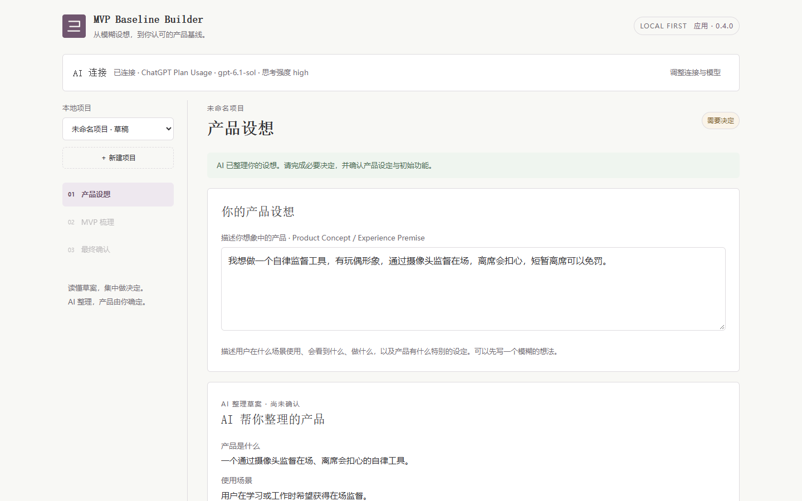
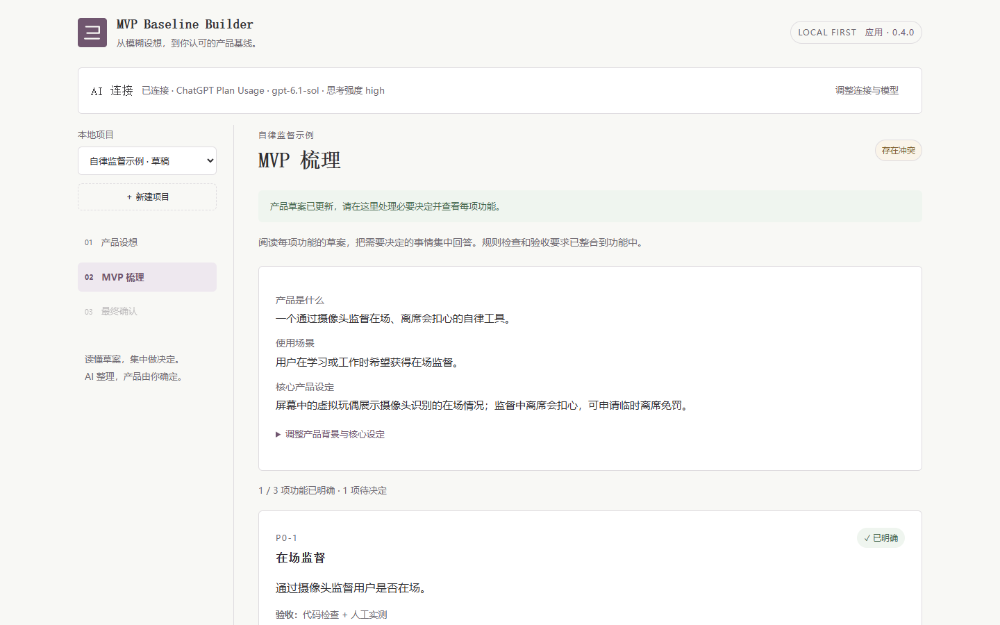
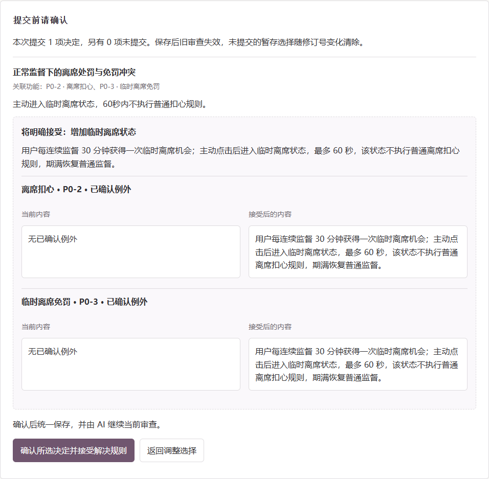
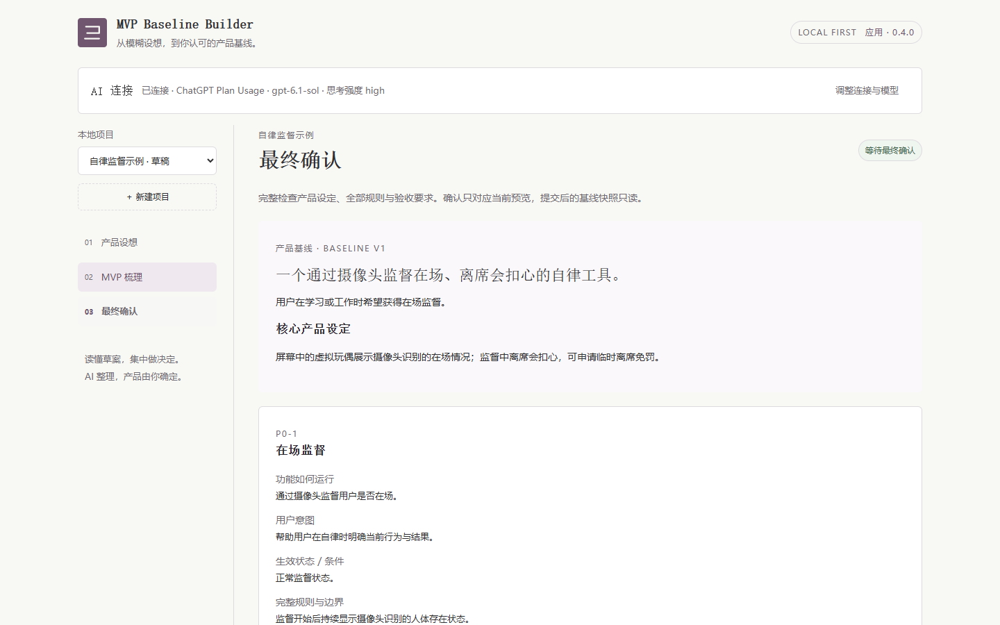
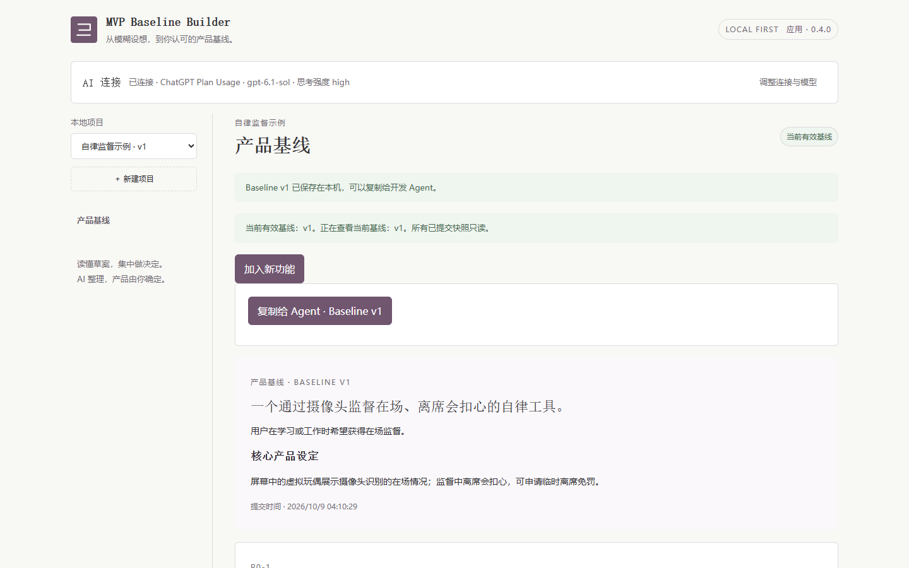
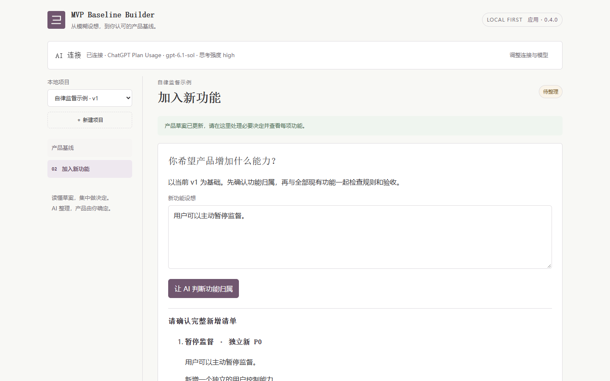
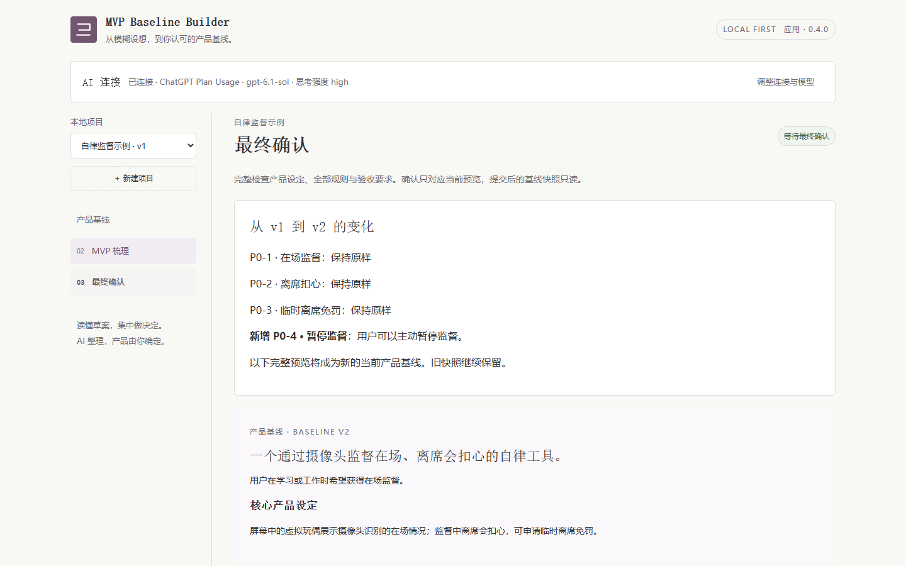

# 从设想到 Baseline v2

## 关键演示视频

[下载 MP4 · 约 1 分 50 秒](https://github.com/zj-liang/mvp-baseline-builder/releases/download/demo-0.4.0/mvp-baseline-builder-key-demo.mp4)（1080p，约 31 MB），建议全屏观看。

短片来自作者提供的应用录屏，保留了确认初始功能、规则选择、v1 提交、新增功能归属、冲突方案前后对照与明确接受、v2 提交及历史版本切换。它是关键节点的节选，省略了部分输入、等待、滚动和中间操作，不是连续的完整操作记录，也不作为新的模型语义验收证据。完整原视频和案例 PDF 未上传。

视频与下面七张图是两份不同的演示材料。下面的截图使用隔离数据和模拟 AI；视频中显示的连接状态不用于证明模型的实际接入或输出正确性。两组材料中的自律工具都只是待整理的产品设想，本应用没有实现它们。

## 静态界面导览

下面七张图来自同一份隔离工作区，使用应用本身的界面，没有重画页面或修改显示文案。AI 输出来自预制 Provider；它用于展示操作和检查程序机制，不能说明真实模型会生成相同内容。截图中的连接状态也是模拟状态。

例子是一个待开发的自律监督工具：摄像头监督在场、离席扣心、短暂离席可以免罚。MVP Baseline Builder 只整理它的产品规则，没有实现这个工具。具体秒数与方案是演示样例，不是默认产品规则。

## 1. 先确认整体设想

使用者用自己的话描述想法，阅读 AI 整理出的产品设定和功能清单。设想阶段的选项没有预选；整体确认后，才进入 MVP 梳理。

## 2. 看完整草案，再集中做决定

MVP 梳理页保留产品摘要、稳定编号的功能卡和各自的审查状态。本例确认了三个 P0；离席扣心和临时离席免罚的规则在正常监督下发生冲突，需要使用者决定。

## 3. 接受规则前，先看会改什么

选择方案后，应用展示确认汇总，以及当前字段和接受后的字段。本例选择独立的临时离席状态，并主动接受解决规则。选择“暂不确定”时，问题继续阻止最终预览；建议尚未接受时，也不会写入产品规则。

## 4. 阅读完整预览

四项审查和问题台账满足当前修订的条件后，使用者可以查看完整产品、规则、例外和验证要求。勾选指定确认语句之前，提交按钮不可用。

## 5. 保存第一份只读基线

主动提交后得到 Baseline v1。复制给开发 Agent 使用保存的全文，不带入草稿对话或未接受建议。可以直接阅读应用实际导出的[示例 Baseline v1](examples/baseline-v1.md)；文件保留了隔离提交的真实时间和完整原文。

## 6. 新增一个功能，先确认归属

使用者提出“用户可以主动暂停监督”。应用整理新增清单，先确认它是独立新 P0 还是已有 P0 的补充，再审查与现有规则的关系。本例是独立新功能。

## 7. 预览新版本，旧版本继续保留

新增草稿重新审查全部 P0。最终预览包含完整产品与变化；提交前，当前 v1 保持原样。明确确认后生成 v2，并可以查看历史 v1。

本次隔离演示检查了旧基线在草稿期间未被改写、提交前的勾选保护、v1/v2 历史保留、刷新恢复和窄屏无横向溢出。应用实际导出的[示例 Baseline v2](examples/baseline-v2.md)包含新增的 P0-4；这些检查均未调用真实模型，也没有访问正式项目数据。

验证范围和未验证项见[验证记录](../VALIDATION.md)。如果想自己走一遍，按[使用说明](USER_GUIDE.md)启动，并配置自己的 AI 连接；本次预制演示没有作为新功能加入应用。
